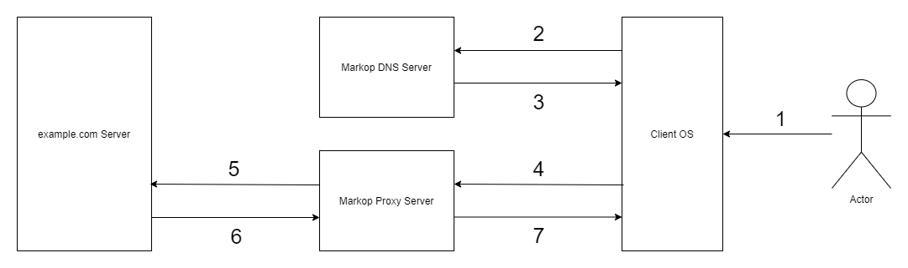

# Markop Proxy
A DNS server and SNI proxy server help proxy the HTTP and packet over TLS traffic just with config DNS on the client-side.

## What is the SNI Proxy Server?
SNI Proxy Server proxy incoming traffic based on the hostname contained in the TCP session.
For example, in HTTPv1 protocol with a Host header to determine the actual destination of packets and TLS protocol with the help of server name extension, the proxy server determines the actual destination.

## How does Markop Proxy work?
This flow describe how client send a Http request to example.com server

1. Client setup Markop DNS server as OS default DNS server
2. Client OS sends DNS query to Markop DNS server to resolve example.com into IPv4
3. Markop DNS server checks its white list record and resolve example.com into Markop Proxy server IP
4. OS sends a Http request to Markop Proxy server IP
   5.1. Markop Proxy server parse and analyze the data to extract request hostname(example.com)
   5.2. Markop Proxy server sends data into hostname(example.com)
6. Example.com server sends response to Markop Proxy server
7. Markop Proxy server sends response to client OS

## Stress Test
Proxy HTTPS traffic to web server created by [serve](https://www.npmjs.com/package/serve) \
Serve Command:
```shell
$  serve -s build --ssl-cert cert.pem --ssl-key key.pem --ssl-pass pass.key -l 443
```
Result:
```shell
[+] Start Stress Test
[+] Success: 1000 Failed: 0
[+] AVG: 2461.872 MAX: 3622 MIN: 874
[+] Success: 1000 Failed: 0
[+] AVG: 1492.546 MAX: 1809 MIN: 644
[+] Success: 1000 Failed: 0
[+] AVG: 592.105 MAX: 657 MIN: 454
[+] Success: 1000 Failed: 0
[+] AVG: 305.548 MAX: 416 MIN: 276
[+] Success: 1000 Failed: 0
[+] AVG: 245.76 MAX: 342 MIN: 185
[+] Success: 1000 Failed: 0
[+] AVG: 225.83 MAX: 351 MIN: 159
[+] Success: 1000 Failed: 0
[+] AVG: 224.214 MAX: 296 MIN: 140
[+] Success: 1000 Failed: 0
[+] AVG: 230.956 MAX: 331 MIN: 162
[+] Success: 1000 Failed: 0
[+] AVG: 232.542 MAX: 316 MIN: 83
[+] Success: 1000 Failed: 0
[+] AVG: 234.705 MAX: 291 MIN: 178
[+] Stress Test Finished
```

## Feature
- Support HTTPv1, TLS protocols
- Multiple listening sockets

## Usage
```sh
$ git clone https://github.com/MarkopDev/MarkopProxy
$ cd MarkopProxy/MarkopProxy
$ dotnet publish -c Release -o build
```

### Build Project
```sh
$ dotnet publish -c Release -o build
```

### Docker
```sh
$ docker-compose up -d
```
or
```sh
$ docker build -t markop-proxy .
$ docker run -d markop-proxy
```

## Contributions
If you're interested in contributing to this project, first of all, We would like to extend my heartfelt gratitude. \
Please feel free to reach out to us if you need help.

## LICENSE
MIT